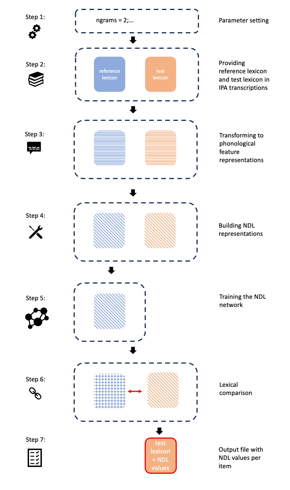
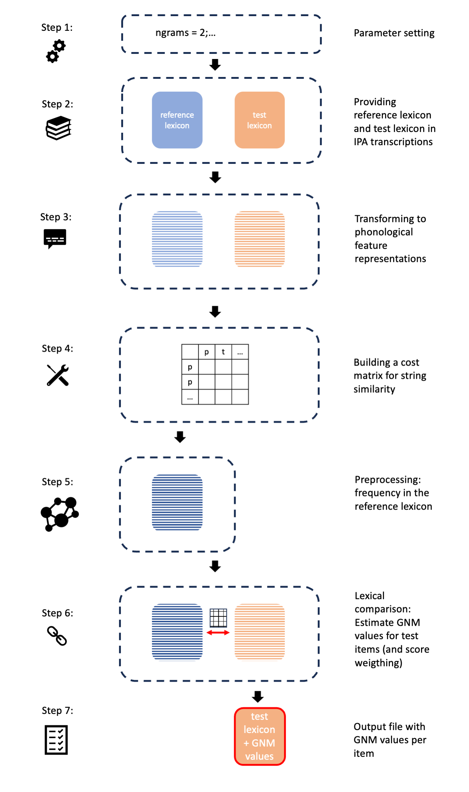

# Summary

In empirical research, claims often rely on human behavior in response to a limited set of stimuli. Researchers must justify their choice of stimuli and are sometimes criticized for whether these choices may have influenced the results. This paper introduces a method to control for the potential influence of experimental stimuli. Specifically, we propose measuring the wordlikeness of stimuli as a variable and incorporating it as a control in statistical analyses. The method is flexible and can be applied to compare any real or artificial test item set with any real or artificial reference set—for example, using a first-language (L1) corpus to estimate the L1 wordlikeness of test items, or an artificial reference corpus in artificial language learning tasks. In doing so, researchers can better account for and control the influence of the test items themselves.

More specifically, this paper introduces an R package with a comprehensive tutorial for comparing lexical similarity across two lexicons. Words in a test lexicon are evaluated against a reference lexicon in terms of their lexical similarity. The package implements two psycholinguistic approaches. The first is based on discriminative learning [@baayen2011amorphous], in which wordlikeness of test items is assessed relative to the reference lexicon using naive discriminative learning. The second is based on analogical learning [@Nosofsky1986], where wordlikeness is evaluated through a generalized neighborhood model. By integrating these approaches in an accessible tool, the package makes it easier for researchers to control and compare lexical similarity of different theoretical frameworks. 

# Statement of need
In experimental linguistics, stimuli are usually carefully controlled and this holds for across varieties of paradigms that involved several populations. Linguistic materials are known to interact with participants’ prior knowledge. More specifically, L1 knowledge of the participants affects how they process the stimuli, whether it be other L1 words, L2 words, or pseudowords. This interaction becomes more complex in language-learning paradigms that include training with real (e.g., L2, L3) or artificial language material, because stimuli are influenced both by participants’ L1 and by the learned language.

A typical experimental paradigm in linguistics and psychology requires preselected language materials that are controlled for classic psycholinguistic factors such as frequency, age of acquisition and semantic transparency among others as well as for the experimental factor of interest. However, a factor  that has received comparatively little attention is the lexical similarity between a target stimulus and the knowledge of the participant, whether it is their L1 knowledge, an additional learned real language or an learned artificial language.

@TangBH2023 present a method for quantifying and controlling this factor. In a cross-linguistic artificial-language-learning study with Mandarin and German speakers, they controlled test items for both L1 wordlikeness and wordlikeness relative to the   artificial lexicon that the participants were trained on. Lexical similarity was operationalized using analogical modeling [@Nosofsky1986; @bailey2001determinants] and discriminative learning [@baayen2011amorphous; @arppe2015ndl]. More specifically, @TangBH2023 controlled the target items at the level of phonological features for similarity both to L1 lexicons and to participants’ individualized training lexicons. These similarity measures were then included as covariates in the statistical analyses. 

Building on @TangBH2023's approach, the present paper delivers an R package [@RCT2013] that, to our knowledge, is the first to integrate these established psycholinguistic methods into a single, user-friendly toolkit. The package supports comparisons between any real or artificial test and reference lexicons and contains step-by-step tutorials, example datasets, and R code demonstrating how to compute lexical similarity via (a) naive discriminative learning (henceforth NDL) and (b) a generalized neighborhood model (henceforth GNM).

We implemented the package in R because it is the de facto standard for statistical analysis and visualization in experimental linguistics and psychology. To lower the computational barrier for researchers without extensive programming experience, we also provide pretrained English models and ready-to-use example code that compares a test lexicon with a reference lexicon. By making these methods accessible, the package enables researchers to routinely estimate and control lexical similarity as covariates, therefore improving the rigor, transparency, and reproducibility of experiments that rely on limited stimulus sets. In the following sections, we first provide a step-by-step tutorial for lexicon comparison based on discriminative learning, and subsequently present a tutorial based on analogical learning.

# Naive Discriminative Learning (NDL) Implementation

To compare two lexicons using Naive Discriminative Learning (NDL), we provide all necessary code in the accompanying folder `NDLcomp` in [@LexComp]. This folder includes:

* `NDL.Rmd` – R code implementing the comparison procedure
* `data/featureChart/phoible-segments-features_adapted_v4.csv` – a phonological feature table
* `data/lexicon/ref_lex.csv` – an example reference lexicon
* `data/lexicon/test_lex.csv` – an example test lexicon
* `data/lexicon/EN_ref_lex.csv` – an English reference lexicon
* `data/output` – an empty folder for results

The procedure assesses measures of lexical similarity to the reference lexicon for all items in the test lexicon based on discriminative learning. We illustrate the workflow with a toy reference lexicon and and a toy test lexicon containing artificial items. To assess wordlikeness measures for native languages the procedure can also be applied to real languages by using a corpus of a real language as a reference lexicon (see step 2 for the English lexicon example).

The workflow is structured into seven steps, which are explained below. The R code corresponds directly to these steps and also includes suggestions for visualizing the results.

- **Preparations**: 

Required R packages are loaded (and installed if missing). The number of computing cores to be used for parallel processing is also specified.

- **Step 1**: Parameter setting

Model parameters are defined, including the specification of the desired n-gram settings.

- **Step 2**: Providing lexicons

Both the reference lexicon and the test lexicon are loaded. In the example setup, these lexicons consist of short lists of artificial items, which the user can replace or expand as needed. The reference lexicon contains the items against which the test stimuli will be compared. The test lexicon contains the items for which wordlikeness measures are computed.

In our example, these items are modeled after typical pseudoword stimuli in an artificial language learning task. The reference lexicon (`ref_lex.csv`) may contain items such as \<galo\> and \<gemo\>, while the test lexicon (`test_lex.csv`) contains pseudowords such as \<banu\> and \<beda\>. Both lexicons must be available in IPA transcription. To keep the illustration simple and computationally lightweight, only a few items are provided in the example files.

For comparison with a real lexicon, we provide an English reference lexicon (`EN_ref_lex.tsv`), which is derived from SUBTLEX-US – a frequency lexicon of US English [@Brysbaert2009] and MFA Dictionary v2.2.1 – a US English pronunciation dictionary in the International Phonetic Alphabet [@mfa_english_us_mfa_dictionary_2023]. First, we restricted the lexical entries of the frequency lexicon in two ways: i) only the entries that are indicated as a valid word with a spellchecker, Hunspell (US English) [@hunspell2023], and ii) only the entries that have a contextual diversity value above 3 (i.e., only words that have appeared in at least four subtitle files were kept). Second, we restricted the pronunciation dictionary to contain only one pronunciation per lexical entry. If a lexical entry contains multiple pronunciations, then the pronunciation with the highest probability estimate (provided by the dictionary) was chosen. Finally, the frequency lexicon and the pronunciation lexicon were merged and 33,728 entries with both frequency information and a pronunciation were kept. The user can load this lexicon `EN_ref_lex.tsv` as a reference lexicon to estimate wordlikeness measures for English.

- **Step 3**: Providing phonological features

To prepare the translation of IPA entries in both lexicons into phonological features we need to provide this information about phonological features. For this purpose the phonological distinctive feature systems from PHOIBLE [@phoible] is loaded: `phoible-segments-features.tsv`.  For detailed explanation of this feature set: see https://github.com/phoible/dev/tree/master/raw-data/FEATURES. To obtain this particular version of the feature set: https://github.com/phoible/dev/blob/c71dce66f736b161e42f335f253c35706e217dbe/raw-data/FEATURES/phoible-segments-features.tsv. The feature table provides phonological feature specifications for all IPA symbols. During the procedure it is trimmed to the needs of our study: IPA symbols not occurring in the data sets are identified and deleted and additional IPA symbols can be added.

- **Step 4**: Building NDL representations

IPA entries in both lexicons need to be translated into phonological features. 
A function is being introduced which takes in the string of segments (word in IPA transcription) and translates it into ndl-formatted feature ngrams as defined in Step 1: Parameter setting. This function `featurengram()` is then applied to the data set of both the reference and the test lexicon. All lexical entries in both lexicons are translated into ndl-cues, where the cues have the format of phonological feature bigrams. As a result, the lexicons consist not only of segments but also of feature bigrams.

- **Step 5**: Model training with reference lexicon

In this step, we train the NDL model. The associative network now represents a lexicon consisting of the reference lexicon in phonological feature bigrams.

- **Step 6**: Lexical comparison

The network is now being evaluated with respect to our items of interest in the test lexicon and results are displayed in a table. For each lexical entry in the test lexicon, several activation-based measurements based on the reference lexicon are provided: 

1. `max.act.cand`: The most activated training outcome 
2. `max.activation`: The activation value of the `max.act.cand`
3. `L1norm`: The sum of the absolute values of the vector of the outcome activations given all the cues of a test word. An `L1norm` close to zero indicates a lack of contact with the lexicon; while a larger value indicates a higher level of wordlikeness. Give a vector of activations `a`, the L1-norm of this vector is given by 
$$|a|_{1} = \sum_{i}^{}|a|$$
4. `L2norm`: It is conceptually similar to `L1norm` and `MADnorm`. It is calculated as the square root of the sum of the squared vector values. Give a vector of activations `a`, the L2-norm of this vector is given by 
$$|a|_{2} = \left ( \sum_{i}^{}|a|^2 \right )^\frac{1}{2}$$
5. `MADnorm`: It is conceptually similar to `L1norm` and `L2norm`. It is calculated using the median absolute deviation [@Howell2005;@Leys2013]

`L1norm`, `L2norm` and `MADnorm` tend to be highly correlated [@Milin2017;@ChuangBaayen2021DiscriminativeLearningandtheLexicon;@Arnold2017]. `L1norm` is the more commonly reported measures by users of NDL.

- **Step 7**: Output file with estimated lexical similarity

The evaluation results are collected in an output table.

- **Visualizations**:

This section provides three visualization suggestions for the user which may be helpful for identifying test items that are outliers (particularly wordlike or nonwordlike).
The first code visualizes results using only one variable of wordlikeness at a time using optimal (weighted) univariate clustering.
The second code visualizes results using multiple variables of wordlikeness using PCA. It creates principle components, plots the first two components, and visualizes each item in a two-dimensional space along with each of the individual variables and their relationship with the the components.
The third code visualizes results using multiple variables of wordlikeness with a parallel coordinate plot. This is useful as it connects all wordlikeness variables, and each item is represented as a line. One can spot the odd item that deviates from the rest for all of the variables or just one variable.

The workflow of the procedure which are shown in figure \autoref{fig:workflow_ndl}. 

{width=100%}

# Generalized Neighborhood Model (GNM) Implementation

For comparing two lexicons with a generalized neighborhood model (GNM), we provide all necessary code in the accompanying folder `GNMcomp` in [@LexComp]. This folder includes:

* `GNM.Rmd` – R code implementing the comparison procedure
* `data/featureChart/phoible-segments-features_adapted_v4.csv` – a phonological feature table
* `data/lexicon/ref_lex.csv` – an example reference lexicon
* `data/lexicon/test_lex.csv` – an example test lexicon
* `data/lexicon/EN_ref_lex.csv` – an English reference lexicon
* `data/output` – an empty folder for results

The procedure assesses measures of lexical similarity to the reference lexicon for all items in the test lexicon based on analogical modeling. We illustrate the workflow with a toy reference lexicon and and a toy test lexicon containing artificial items. 

Just as with the NDL implementation, the workflow is structured into seven steps, which are explained below, with Step 2 and 3 being identical for both NDL and GNM implementations. The R code corresponds directly to these steps and also includes suggestions for visualizing the results.

- **Preparations**: 

Required R packages are loaded (and installed if missing). The number of computing cores to be used for parallel processing is also specified.

- **Step 1**: Parameter setting

Here, we define the parameters for our modeling. 

There are three sets of free parameters: parameters for string similarity, distance decay, and the frequency effect. 

Parameters for string similarity include: the cost for correct segment matches (`iden`), the cost of insertion or deletion (`indel`), the cost of featural underspecification `underspec_cost`. The cost of matched segments ranges between 0 and 1 (default: 0). The cost of insertion or deletion follows @albright2007natural, with values ranging between 0 and 1 (default: 0.7). To account for featural underspecification, we set underspec_cost = 0.25 as the default following @corpusTools_phonoalign.

One parameter for governing distance decay is `D`. It is defined as `1/s`, where `s` is a sensitivity parameter controlling the magnitude of the advantage that very similar neighbors have in determining outcomes (default: `s` = 0.1739; @albright2007natural).

Parameters for the frequency effect include whether of not to enable frequency weighting (`frequency_weighting_tf`: Boolean value), the quadratic coefficient to model a quadratic frequency effect (`freq_quad_coeff`, default: 0), the linear coefficient to model a linear frequency effect (`freq_linear_coeff`, default: 1), the constant coefficient (`freq_content_coeff`, default: 0). Frequency is weighted using a quadratic equation, following @bailey2001determinants, to capture both linear and non-linear effects. By default, we assume a monotonic relationship. Please refer to the code for implementation details.

Two additional parameters allow for users to designate the frequency type of the reference lexicon (`reference_frequency_type`, the possible types: RAW (raw token frequency, the default) and FPM (frequency per million)), as well as the frequency to use (`frequency_normalised_tf`, default: FALSE which uses raw frequency values, while TRUE uses frequency per million). If `frequency_normalised_tf` is TRUE and `reference_frequency_type` is 'RAW', then it would normalize your RAW frequency by assuming the sum of your token frequency count is the corpus size.

- **Step 2**: Providing lexicons

This step is identical to step 2 of the **NDL Implementation**:
Both the reference lexicon and test lexicon are providedin IPA trancriptions. The reference lexicon contains the lexicon against which the test stimuli shall be compared. The test lexicon contains items for which we want to examine wordlikeness measures. Our example lexicons consist of short lists of artificial items, both containing few items, the `ref_lex.csv` as well as the `test_lex.csv`. While the reference lexicon may contain Items like \<galo\> and \<gemo\>, the test lexicon contains pseudowords like \<banu\> and \<beda\>.

As explained in step 2 of the **NDL Implementation**, the users can make use of the real English lexicon we provided `EN_ref_lex.tsv`. 

- **Step 3**: Providing phonological features

This step is identical to step 2 of the **NDL Implementation**:
To prepare the translation of IPA entries in both lexicons into phonological features we use the PHOIBLE [@phoible] feature table `phoible-segments-features.tsv` that provides phonological feature specifications for all IPA symbols. During the procedure it is trimmed to the needs of our study: IPA symbols not occurring in the data sets are identified and deleted and additional IPA symbols can be added.

- **Step 4**: Building a cost matrix for string similarity

The goal of this step is to create a cost matrix for the direct comparison of two lexicons. Individual sounds are compared based on the values in the feature table. The cost matrix finally contains distance values between 0 and 1. The exact cost of a change depends on whether there is no change (identical), or if it involves a substitution, a insertion or a deletion. As explained and defined in step 2 of the **Parameter setting** the cost for identical sounds (`iden`), that is, no change, is 0 (min: 0, max: 1, default: 0), the cost for insertion or deletion of segments is (min: 0, max: 1, default: 0.7) [@albright2007natural]. 

For substitutions we apply the function `phonDistMetric_FeatureMismatchWithUnderspec`. It estimates a distance value based on the table with feature values. Featural underspecification, `underspec_cost`, is taken into account as it is set to 0.25  following @corpusTools_phonoalign. 

Finally, the cost matrix is generated. It stores all possible pairwise combinations of sounds, as well as all possible deletions and insertions. The cost value in each cell indicates how distant the sounds to be compared are. A small number means little distance, i.e. greater similarity between the sounds. A greater number means more distance, i.e. smaller similarity between the sounds.

- **Step 5**: Preprocessing: reference lexicon frequency 

The present step prepares the reference lexicon for the comparison to the test lexicon in the next step. Preprocessing consists of several options to possibly adjust frequency information for later weighting of scores:

The user clarifies with respective designation whether the frequency measure they want to use is the raw frequency or the frequency per million. This has been specified in the earlier parameter setting step. It was there when the user has specified whether they want to normalize frequency. 
There are several options: first, if the user has provided raw frequencies but wanted to normalize it, then (and only then) it is normalized in this step as explained as follows: The raw frequencies across all items are considered to be the corpus size which functions as a base to normalize individual raw frequency values to a frequency-per-million value. Second, if frequency is already in the format of frequency per million, then nothing happens. Third, if the user has normalized frequency values and wants raw frequency values instead, this code transforms normalized data into raw frequencies.
Finally, if the chosen frequency type (raw or frequency-per-million) has values that are too small for log10 transformation, then it will be smoothed.

- **Step 6**: Estimate GNM values for test items

In this step, we estimate a GNM similarity value for each test item. Hereby, every test items is evaluated against the reference lexicon. More specifically, based on the cost matrix the psychological distance is generated between the test item and all the words in the reference lexicon. The result is a vector of distances, one for each test item. In a next step, the vector of distance scores is weighted according to the decay and the frequency. Frequency and decay weighting works as follows:
First, using the Distance decay parameter [@albright2007natural], values are weighted in such a way that more distant reference items are weighted less important and closer refercne items are weighted more important. Second, the algorithm weights distance scores differently based on the chosen frequency information (as chosen by the user in earlier steps): In general, a more frequent item from the reference lexicon receives more impact and weight than a less frequent item. The result for each test item is a vector of distances that have been weighted according to the distance and the frequency information available.

In the final step, all numbers in the vector are summed up and represent the GNM distance value for the specific test item. 

- **Step 7**: Output file with estimated lexical similarity

We collect the evaluation results in an output table and save it. The output table contains each item together with its similarity value as derived from this procedure.

- **Visualizations**:

We provide a visualization suggestion for the user which may be helpful for identifying test items that are outliers (particularly wordlike or nonwordlike) according to the GNM analysis. Results are visualized over the variable of GNM score per item using optimal (weighted) univariate clustering.

The workflow of the procedure which are shown in figure \autoref{fig:workflow_gnm}. 

{width=100%}

<!-- # Acknowledgements -->

<!-- We acknowledge contributions from X and Y. -->

# References